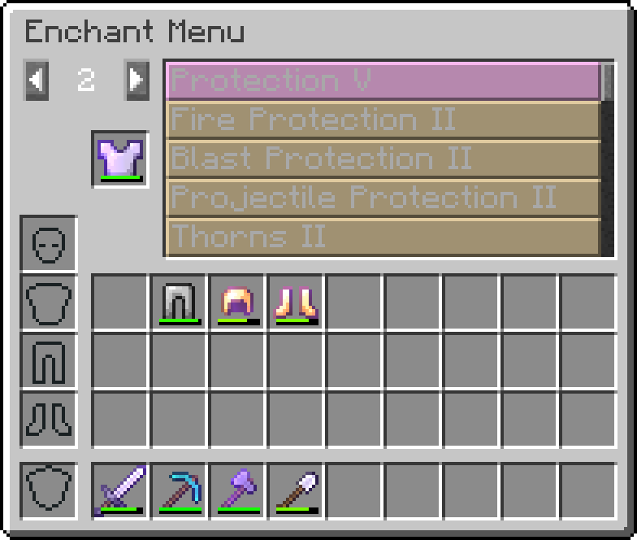
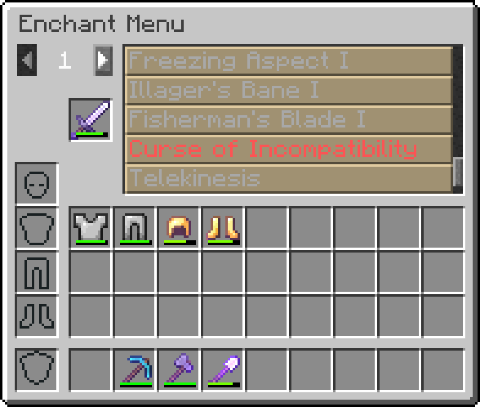

# 

Enchant Menu adds a simple menu for modifying item enchantments.

## Current Features
- Select enchantments from the list of possible enchantments
- Select the level of enchantment from 1 to 10
- Supports custom enchantments
- Toggle to surpass vanilla level limits
- Toggle to allow incompatible enchantments
- Toggle to allow treasure-only enchantments

## Planned Features
- Enchantment search box
- Configuration of menu features

## Gallery

## Credit

This mod is based on the enchanting tool included in NEI from the days of Tekkit Classic - Thanks to the original
creator for the inspiration!
