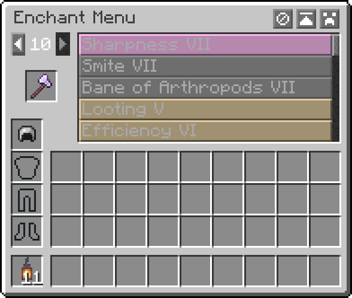

# 

Enchant Menu adds a simple menu for modifying item enchantments.

## Getting Started
- Press X while ingame to open the interface
- Place an enchantable item in and select your enchantments
- Keys can be changed in Minecraft controls settings

## Features
- Select enchantments from the list of possible enchantments
- Select the level of enchantment from 1 to 10
- Supports custom enchantments
- Toggle to surpass vanilla level limits
- Toggle to allow incompatible enchantments
- Toggle to allow treasure-only enchantments
- Configuration of menu features
- Enchantment search box

## Gallery

## Credit

This mod is based on the enchanting tool included in NEI from the days of Tekkit Classic - Thanks to the original
creator for the inspiration!
